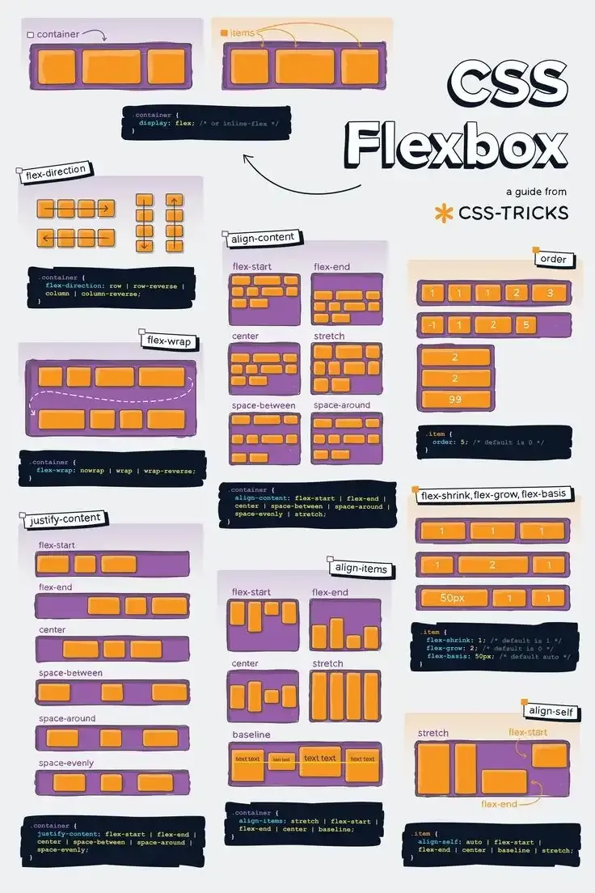
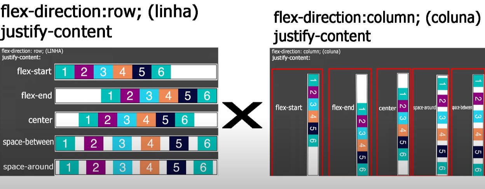

## 📘 Guia Prático de Flexbox com Exemplos Visuais

### 1. Conceito de Flexbox

O Flexbox é um modelo de layout unidimensional do CSS3 que permite distribuir espaço entre os itens de um contêiner, mesmo quando seu tamanho é desconhecido ou dinâmico. Ele facilita o alinhamento e a distribuição de espaço entre os elementos em uma interface, tornando o design mais responsivo e eficiente.



### 2. Ativando o Flexbox

Para iniciar o uso do Flexbox, defina o contêiner com a propriedade `display: flex`:

```css
.container {
  display: flex;
}
```

### 3. Direção dos Itens: `flex-direction`

Controla a direção dos itens dentro do contêiner:

- `row` (padrão): da esquerda para a direita.
    
- `row-reverse`: da direita para a esquerda.
    
- `column`: de cima para baixo.
    
- `column-reverse`: de baixo para cima.
    

```css
.container {
  display: flex;
  flex-direction: row;
}
```



### 4. Quebra de Linha: `flex-wrap`

Define se os itens devem quebrar a linha quando não houver espaço suficiente:

- `nowrap` (padrão): todos os itens em uma única linha.
    
- `wrap`: os itens quebram para a próxima linha.
    
- `wrap-reverse`: os itens quebram para a linha anterior.
    

```css
.container {
  display: flex;
  flex-wrap: wrap;
}
```

### 5. Alinhamento no Eixo Principal: `justify-content`

Alinha os itens ao longo do eixo principal:

- `flex-start`: início do contêiner.
    
- `flex-end`: final do contêiner.
    
- `center`: centro do contêiner.
    
- `space-between`: espaçamento igual entre os itens.
    
- `space-around`: espaçamento igual ao redor dos itens.
    
- `space-evenly`: espaçamento igual entre os itens e as bordas do contêiner.
    

```css
.container {
  display: flex;
  justify-content: space-between;
}
```

### 6. Alinhamento no Eixo Cruzado: `align-items`

Alinha os itens ao longo do eixo perpendicular ao principal:

- `stretch` (padrão): estica os itens para preencher o contêiner.
    
- `flex-start`: início do eixo cruzado.
    
- `flex-end`: final do eixo cruzado.
    
- `center`: centro do eixo cruzado.
    
- `baseline`: alinhamento baseado na linha de base do texto.
    

```css
.container {
  display: flex;
  align-items: center;
}
```

### 7. Alinhamento de Múltiplas Linhas: `align-content`

Alinha as linhas dentro do contêiner quando há quebra de linha:

- `flex-start`: início do contêiner.
    
- `flex-end`: final do contêiner.
    
- `center`: centro do contêiner.
    
- `space-between`: espaçamento igual entre as linhas.
    
- `space-around`: espaçamento igual ao redor das linhas.
    
- `stretch` (padrão): estica as linhas para preencher o contêiner.
    

```css
.container {
  display: flex;
  flex-wrap: wrap;
  align-content: space-around;
}
```

### 8. Propriedades dos Itens Flexíveis

#### a. `order`

Define a ordem dos itens dentro do contêiner:

```css
.item {
  order: 2;
}
```

#### b. `flex-grow`

Determina quanto um item pode crescer em relação aos demais:

```css
.item {
  flex-grow: 1;
}
```

#### c. `flex-shrink`

Determina quanto um item pode encolher em relação aos demais:

```css
.item {
  flex-shrink: 1;
}
```

#### d. `flex-basis`

Define o tamanho inicial do item antes da distribuição do espaço restante:

```css
.item {
  flex-basis: 200px;
}
```

#### e. Shorthand: `flex`

Combina `flex-grow`, `flex-shrink` e `flex-basis`:

```css
.item {
  flex: 1 1 200px;
}
```

#### f. `align-self`

Permite que um item sobrescreva o alinhamento definido por `align-items`:

```css
.item {
  align-self: flex-end;
}
```

---

## 📎 Exemplo Prático

Vamos aplicar os conceitos acima em um exemplo prático:

```html
<!DOCTYPE html>
<html lang="pt-BR">
<head>
  <meta charset="UTF-8">
  <title>Exemplo Flexbox</title>
  <style>
    .container {
      display: flex;
      flex-direction: row;
      flex-wrap: wrap;
      justify-content: space-around;
      align-items: center;
      height: 300px;
      border: 2px solid #000;
    }
    .item {
      background-color: #4CAF50;
      color: white;
      padding: 20px;
      margin: 10px;
      flex: 1 1 100px;
      text-align: center;
    }
  </style>
</head>
<body>
  <div class="container">
    <div class="item">Item 1</div>
    <div class="item">Item 2</div>
    <div class="item">Item 3</div>
    <div class="item">Item 4</div>
  </div>
</body>
</html>
```

Neste exemplo:

- O contêiner `.container` utiliza `display: flex` com `flex-wrap: wrap` para permitir que os itens quebrem a linha quando necessário.
    
- Os itens `.item` têm `flex: 1 1 100px`, o que significa que eles podem crescer e encolher conforme o espaço disponível, com um tamanho base de 100px.
    
- `justify-content: space-around` distribui os itens com espaçamento igual ao redor deles.
    
- `align-items: center` alinha os itens verticalmente ao centro do contêiner.
    

---

Para visualizar exemplos interativos e aprofundar seus conhecimentos, você pode explorar os seguintes recursos:
    
- [Flexbox – a ficha informativa perfeita de flexbox no CSS (com diagramas animados)](https://www.freecodecamp.org/portuguese/news/flexbox-a-ficha-informativa-perfeita-de-flexbox-no-css-com-diagramas-animados/)
    
- [CSS Flexible Box Layout - CSS | MDN](https://developer.mozilla.org/pt-BR/docs/Web/CSS/CSS_flexible_box_layout)
    

Esses recursos oferecem diagramas e exemplos práticos que podem ajudá-lo a entender melhor o funcionamento do Flexbox.